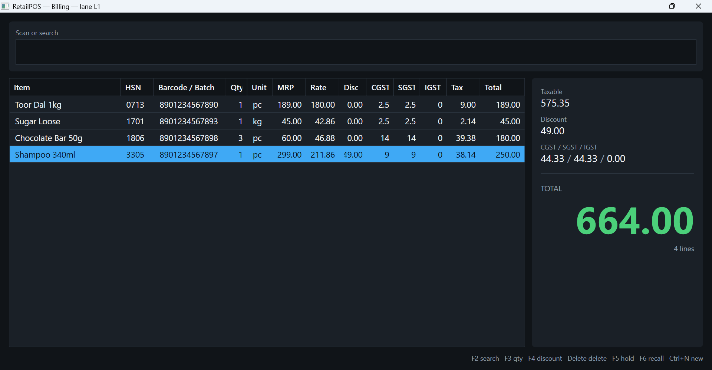
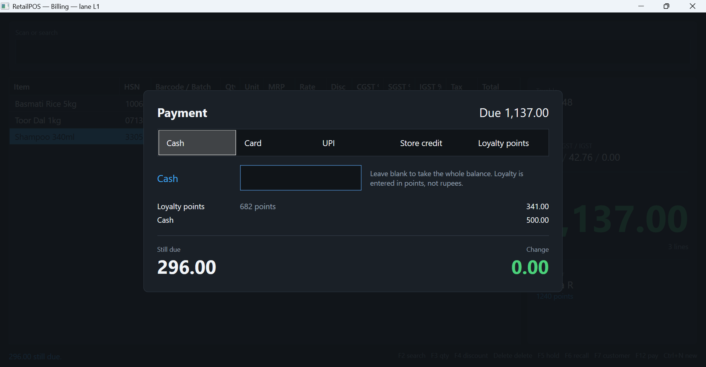

# RetailPOS

A native Windows desktop POS/billing application for Indian retail — grocery, supermarket and
provision stores. It bills entirely offline against a local database, is GST compliant, and is
driven from the keyboard end to end.

This is a **standalone product**, separate from the multi-outlet offline-first ERP platform in
`ERP_Retail`. Architecture, code and docs are not shared between the two.

## Status

| Phase | Scope | State |
|---|---|---|
| 0 | Repo, local DB schema, migrations, CI | Complete, gate passing |
| 1 | GST engine, invoice engine | Complete, gate passing |
| 2 | Item search, line grid, keyboard flow | Complete, gate passing |
| 4 | Loyalty, multi-tender, hold/recall, invoicing | Complete, gate passing |
| 3 | Printer, cash drawer, scanner, scale | Services and tests complete; hardware-in-the-loop pending devices |
| 5 | Multi-lane, offline resilience, hardening | Complete, gate passing |
| — | Pilot readiness: import, day-end, backup, reprint | Complete, gate passing |
| 6 | Pilot | Package and dry run complete; on-site run pending |

Two things are deliberately still open: the Phase 3 hardware-in-the-loop checks, which need the
devices on a counter, and the pilot itself. Everything else has a passing gate.

Start at [docs/PILOT_RUNBOOK.md](docs/PILOT_RUNBOOK.md) if you are the one taking this to a store.

Phase order and gates are defined in [docs/IMPLEMENTATION_PLAN.md](docs/IMPLEMENTATION_PLAN.md)
and [docs/TESTING_STRATEGY.md](docs/TESTING_STRATEGY.md). A phase does not start until the
previous phase's gate passes.

Phases 3 and 4 were deliberately swapped: Phase 3's gate is hardware-in-the-loop testing on real
peripherals, so it cannot close until devices are on site, while Phase 4 is pure logic and is the
half that lets a sale actually be completed. Phase 4 defines the peripheral interfaces and settles
against a fake; Phase 3 supplies the drivers behind them.

## Layout

```
src/Pos.Core.Tax/        GST calculation — pure, stateless, exhaustively tested
src/Pos.Core.Domain/     Invoice, line, item, customer model and the live bill
src/Pos.Core.Data/          SQLite access, migrations, item search, invoice and held-bill storage
src/Pos.Core.Loyalty/       Points accrual and redemption
src/Pos.Core.Hardware/      ESC/POS, receipt layout, scale protocol, barcodes, serial, drivers
src/Pos.Core.Configuration/ Lane settings, and what they build into
src/Pos.App/                WPF UI, MVVM, keyboard routing
src/Pos.Diagnostics/        The `pos` command — peripheral checks and receipt preview
tests/Pos.Core.Tests/       Tax, invoice, loyalty, tender, checkout, hardware protocols, latency
tests/Pos.App.Tests/        Input classification, debounce, keymap, keyboard-only and tender flows
tests/Pos.TestSupport/      Shared fixtures (throwaway database, catalogue generator, fake drawer)
docs/                       Requirements, architecture, plan, testing strategy
```



Everything in that screenshot was done from the keyboard: three barcodes scanned, a quantity
stepped up, and a ₹49 discount applied with F4.



And so was this: customer attached by mobile with F7, tender pane opened with F12, the maximum
allowed loyalty redemption taken, and ₹500 cash on top. The 682 points come to ₹341.00 — the 30%
cap on a ₹1,137 bill — and the bill's GST is untouched by them, because points settle a bill
rather than discounting it.

## Build and test

Requires the .NET 8 SDK.

```
dotnet build RetailPos.sln
dotnet test RetailPos.sln
```

CI runs both on every push, on Windows.

## Configuring a lane

Everything a lane owns lives in `%LOCALAPPDATA%\RetailPOS`: the database, and two optional files
that are created from defaults if absent.

`settings.json` — lane identity and input timing:

```json
{
  "laneId": "L1",
  "outletStateCode": "33",
  "searchDebounceMs": 150,
  "scannerMaxKeystrokeGapMs": 30,
  "loyaltyRedemptionCapPercent": 30,
  "loyaltyRupeesPerPoint": 0.5,
  "loyaltyRupeesPerPointEarned": 50
}
```

`keymap.json` — rebinds keys. List only what you want changed; anything absent keeps its default,
and a gesture you rebind is taken away from whatever action held it:

```json
{
  "bindings": { "F9": "HoldBill", "Ctrl+D": "DeleteLine" }
}
```

`settings.json` also carries the store's details for the receipt header and the lane's peripherals:

```json
{
  "store": { "name": "Sri Lakshmi Stores", "gstin": "33AABCS1429B1ZX" },
  "hardware": {
    "printerName": "POS-80",
    "printerPaperWidthChars": 48,
    "drawerConnection": "Printer",
    "scalePort": "COM3"
  }
}
```

A peripheral left unset is not an error — the lane simply does not have one, and billing carries on
without it. `printerOutputFile` writes receipts to a file instead of a printer, for a lane being
set up before its hardware arrives.

Neither file is silently ignored when malformed. A cashier discovering mid-queue that a key does
nothing is worse than a clear failure at startup, and a lane running under the wrong lane id would
mint invoice numbers that collide with another till's.

## Loading a catalogue

A lane cannot sell anything until its item master is loaded. The importer takes a CSV with these
columns, in any order and any case:

```
sku,barcode,name,hsn_code,unit,mrp,selling_price,gst_rate,is_weighed
DAL001,8901234567890,"Toor Dal, Premium, 1kg",0713,Pcs,189.00,189.00,5,false
SUG001,,Sugar Loose,1701,Kg,45.00,45.00,5,true
```

Nothing is written unless the whole file is clean, and every problem is reported at once — a
rejected import leaves the catalogue exactly as it was. Alongside the obvious checks it refuses a
selling price above MRP, a barcode whose EAN or UPC check digit does not add up, and a `unit` that
contradicts `is_weighed`. Codes of a non-standard length have no check digit to test and are
accepted as-is. Use `--update` for a re-import, which is nearly always a price revision.

## Closing the day

`Shift+F12` at the till, or `pos close-day`. The Z-report leads with the cash figure, because the
first thing anyone does with one is count the drawer against it, and it prints its own
reconciliation checks so a day that does not add up says so on its face. Closing takes a verified
backup as part of the same operation.

A sale belongs to exactly one Z-report: invoices are stamped with the close that reported them
rather than being picked up by a time range, so closing twice is harmless and an old report stays
reproducible.

## Deploying to a lane

```
.\publish.ps1
```

Runs the tests, then stages the whole lane package in `artifacts\lane`: the two executables, the
settings template, the catalogue template and its format guide, the operator runbook, and the
hardware sign-off sheet. Both executables are self-contained — the target machine needs nothing
installed, not even the .NET runtime.

The script refuses to package a `settings.json` that points the printer at a file or carries a real
store name, so a development rig cannot reach a store by accident.

Copy the folder to the lane, then:

```
1. copy settings.json to %LOCALAPPDATA%\RetailPOS\ and edit it   (see SETTINGS.md)
2. pos test-hardware                                             (see HARDWARE_SIGNOFF.md)
3. pos import-items --file catalogue.csv --dry-run, then for real
4. Pos.App.exe
```

## Checking the hardware

Peripherals are driven by a separate tool rather than from the billing screen, because checking one
means printing test pages and firing drawers:

```
pos import-items --file catalogue.csv  # load the catalogue; --update for a price revision
pos close-day                          # Z-report, close the day, take a backup
pos backup-db [--keep N]               # verified snapshot, does not block billing
pos check-db [--quick] [--vacuum]      # check the lane's database for damage
pos test-hardware                      # every configured peripheral
pos test-hardware --printer --drawer   # just these
pos receipt-preview --width 32         # render a sample receipt, no hardware needed
pos list-ports                         # what serial ports this machine can see
```

The printer and drawer checks show what should happen, do it, then ask the operator to confirm what
physically happened — no software can see paper leave a printer. It exits non-zero if a configured
peripheral fails, so it can gate a rollout.

## The two things to know before changing anything

**GST maths is the specification, not an implementation detail.** `TaxEngine` is a pure function
with no I/O so that it can be pinned against an exact table of expected figures, to the paisa.
Every case in `GstTestTableTests` asserts exact equality — never a tolerance. If you change the
engine, the table is what tells you whether you were right. Note the correction recorded in
[docs/ARCHITECTURE.md](docs/ARCHITECTURE.md) §3: the CGST/SGST split divides the rounded tax
rather than rounding each half separately, because the original wording could drift by a paisa.

**Billing never touches the network.** There is no server, no sync, no cloud call anywhere in the
billing path, and nothing may introduce one. A lane generates its own invoice numbers with its
lane id baked in, which is what lets several lanes run with nothing coordinating them.

**Loyalty points are a payment, not a discount.** They offset what the customer hands over and
never touch a line's price, taxable value or GST split. Anything that would make a redemption
change the tax on an invoice is a bug, and the tests assert it directly by pricing the same bill
both ways.

**A peripheral can never cost a sale.** The invoice is written to disk before anything is printed
or kicked. A printer out of paper, a drawer that will not open, a loyalty balance that fails to
write back — each is reported to the cashier and none is allowed to throw out of a completed sale.
Nothing in the hardware layer throws for a device fault; it returns a result and the caller
decides.

**A crash must not leave half a sale behind.** The invoice number is taken inside the same
transaction that writes the invoice, so an interrupted save returns it to the sequence rather than
leaving a hole in a run that has to be unbroken. This is tested by launching a separate process,
letting it get partway through a sale, and killing it — see `CrashDurabilityTests`.
